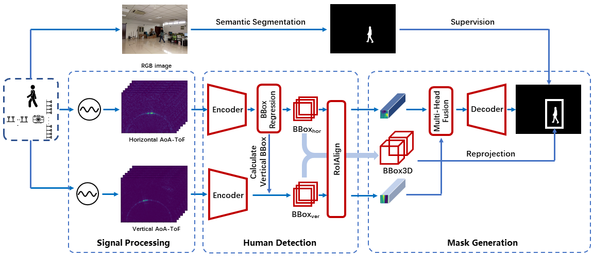

# RFMask
This responsitory contains the code of paper [*RFMask: A Simple Baseline for Human Silhouette Segmentation with Radio Signals*](https://ieeexplore.ieee.org/abstract/document/9793363) which has been accepted by IEEE transactions on Multimedia as regular paper.

## Introduction

The proposed RFMask framework is composed of three modules. It first transforms RF signals captured by millimeter wave radar on two planes into spatial domain and suppress interference with the signal processing module. Then, it locates human reflections on RF frames and extract features from surrounding signals with human detection module. Finally, the extracted features from RF frames are aggregated with an attention based mask generation module.



To verify our proposed framework, we collect a dataset containing 804,760 radio frames and 402,380 camera frames with human activities under various scenes. Experimental results show that the proposed framework can achieve impressive human silhouette segmentation even under the challenging scenarios (such as low light and occlusion scenarios) where traditional optical-camera-based methods fail. To the best of our knowledge, this is the first investigation towards segmenting human silhouette based on millimeter wave signals.

## Install

```
conda env create -f environment.yaml
pip install -r requirements.txt
```

## Usage


### Training

```shell
ulimit -n 1048576
python scrips/main.py
```

### Evaluation

```shell
python scripts/main.py --save_vis --save_pred
```

## Citation

Please cite the following papers [RFMask](https://ieeexplore.ieee.org/abstract/document/9793363):

```text
@ARTICLE{9793363,
  author={Wu, Zhi and Zhang, Dongheng and Xie, Chunyang and Yu, Cong and Chen, Jinbo and Hu, Yang and Chen, Yan},
  journal={IEEE Transactions on Multimedia}, 
  title={RFMask: A Simple Baseline for Human Silhouette Segmentation With Radio Signals}, 
  year={2022},
  volume={},
  number={},
  pages={1-12},
  doi={10.1109/TMM.2022.3181455}}
```

## Reference

* https://github.com/wuzhiwyyx/HIBER
* https://github.com/DI-HGR/cross_domain_gesture_dataset

## Contributing

PRs accepted.

## License

Licensed under the [MIT](LICENSE) License.
